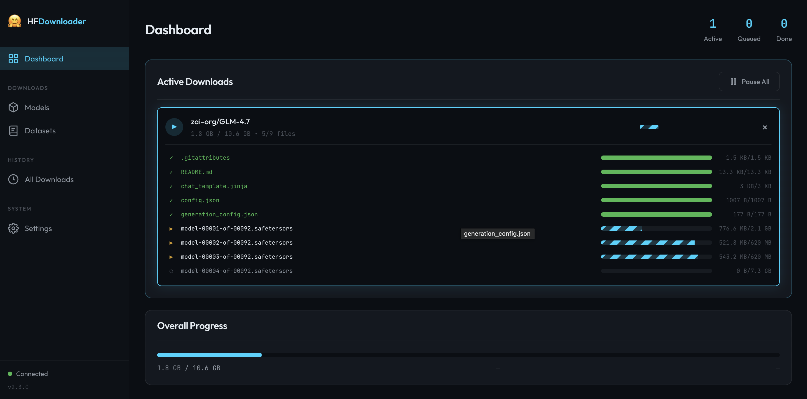
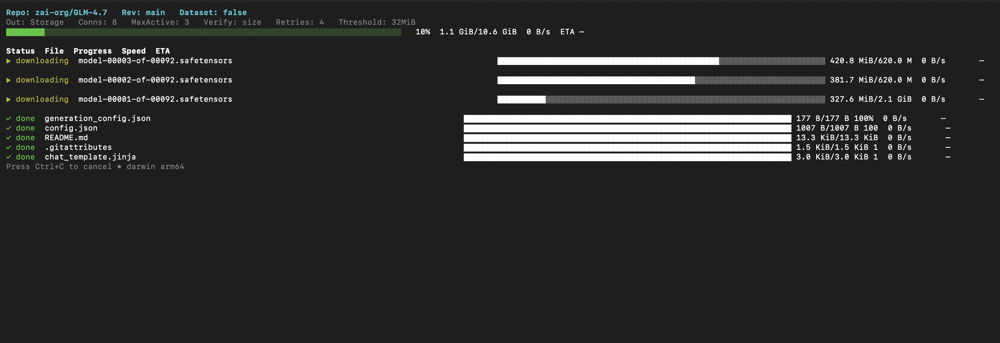

<div align="center">

# 🤗 HuggingFace Downloader

**The fastest way to download models and datasets from the Hugging Face Hub**

[](https://go.dev)
[](LICENSE)
[](https://github.com/bodaay/HuggingFaceModelDownloader/releases)
[](https://github.com/bodaay/HuggingFaceModelDownloader/releases)

**Resumable** • **Multipart** • **Beautiful TUI** • **Web UI** • **Go Library**

[Quick Start](#-quick-start) •
[Installation](#-installation) •
[Web UI](#-web-ui) •
[CLI Reference](#-cli-reference) •
[Go Library](#-go-library)

</div>

---


## 📸 Screenshots

<details open>
<summary><b>Web Interface</b></summary>



</details>

<details>
<summary><b>Terminal UI</b></summary>



</details>

---


## ✨ Features

<table>
<tr>
<td width="50%">

### 🚀 **Blazing Fast**
- Multipart parallel downloads
- Up to 16 connections per file
- Multiple files simultaneously

### 🔄 **Always Resumable**
- SHA-256 verification for LFS files
- Size-based verification for regular files
- No progress files needed

### 🎨 **Beautiful Interface**
- Colorful terminal UI with progress bars
- Web-based dashboard
- JSON events for CI/CD

</td>
<td width="50%">

### 📦 **Flexible Output**
- Models and datasets
- Filter by quantization (q4_0, q5_k_m, etc.)
- Organize into subdirectories

### 🔐 **Private Repos**
- Token authentication
- Gated model support
- Environment variable config

### 🛠️ **Developer Ready**
- Go library with full API
- WebSocket real-time updates
- REST API for integrations

</td>
</tr>
</table>

---

## 🚀 Quick Start

### One-Liner Commands (Linux / macOS / WSL)

```bash
# 🌐 Instant Web UI - opens browser automatically!
bash <(curl -sSL https://g.bodaay.io/hfd) -w

# 📦 Download a model
bash <(curl -sSL https://g.bodaay.io/hfd) download TheBloke/Mistral-7B-GGUF

# 💾 Install for regular use
bash <(curl -sSL https://g.bodaay.io/hfd) -i
```

### After Installation

```bash
# Download a GGUF model
hfdownloader download TheBloke/Mistral-7B-Instruct-v0.2-GGUF

# Download specific quantizations
hfdownloader download TheBloke/Mistral-7B-Instruct-v0.2-GGUF:q4_k_m,q5_k_m

# Download a dataset
hfdownloader download facebook/flores --dataset

# Start web interface
hfdownloader serve
```

That's it! Files are saved to `./Storage/<repo-name>/` by default.

---

## 📥 Installation

### Option 1: One-Liner Script (Recommended)

```bash
# 🌐 Start web UI immediately (no installation, opens browser)
bash <(curl -sSL https://g.bodaay.io/hfd) -w

# 💾 Install to /usr/local/bin
bash <(curl -sSL https://g.bodaay.io/hfd) -i

# 📂 Install to custom location
bash <(curl -sSL https://g.bodaay.io/hfd) -i -p ~/.local/bin

# 📦 Download without installing
bash <(curl -sSL https://g.bodaay.io/hfd) download TheBloke/Mistral-7B-GGUF

# 🌐 Web UI on custom port
bash <(curl -sSL https://g.bodaay.io/hfd) -w 3000
```

### Option 2: Download Binary

Download from [Releases](https://github.com/bodaay/HuggingFaceModelDownloader/releases):

| Platform | Architecture | Download |
|----------|--------------|----------|
| Linux | x86_64 | `hfdownloader_linux_amd64_*` |
| Linux | ARM64 | `hfdownloader_linux_arm64_*` |
| macOS | Apple Silicon | `hfdownloader_darwin_arm64_*` |
| macOS | Intel | `hfdownloader_darwin_amd64_*` |
| Windows | x86_64 | `hfdownloader_windows_amd64_*.exe` |

### Option 3: Build from Source

```bash
git clone https://github.com/bodaay/HuggingFaceModelDownloader
cd HuggingFaceModelDownloader
go build -o hfdownloader ./cmd/hfdownloader
```

### Option 4: Docker 🐳

```bash
# Build the image
docker build -t hfdownloader .

# Run CLI in container
docker run --rm -v ./models:/data hfdownloader download TheBloke/Mistral-7B-GGUF -o /data

# Run web server
docker run --rm -p 8080:8080 -v ./models:/data hfdownloader serve \
  --models-dir /data/Models \
  --datasets-dir /data/Datasets

# With HuggingFace token
docker run --rm -e HF_TOKEN=hf_xxx -p 8080:8080 hfdownloader serve
```

---

## 🌐 Web UI

Start the web server for a browser-based experience:

```bash
hfdownloader serve
# Open http://localhost:8080
```

<!--  -->

**Features:**
- 📊 Real-time download progress via WebSocket
- 📁 Separate pages for Models and Datasets
- ⚙️ Settings management
- 📜 Download history

**Server Options:**

```bash
hfdownloader serve \
  --port 3000 \
  --models-dir ./Models \
  --datasets-dir ./Datasets \
  --token hf_xxx \
  --endpoint https://hf-mirror.com  # Optional: use mirror
```

| Flag | Default | Description |
|------|---------|-------------|
| `-p, --port` | `8080` | Port to listen on |
| `--addr` | `0.0.0.0` | Address to bind to |
| `--models-dir` | `./Models` | Output directory for models |
| `--datasets-dir` | `./Datasets` | Output directory for datasets |
| `-c, --connections` | `8` | Connections per file |
| `--max-active` | `3` | Max concurrent file downloads |
| `--multipart-threshold` | `32MiB` | Use multipart for files >= this size |
| `--verify` | `size` | Verification: `none\|size\|sha256` |
| `--retries` | `4` | Max retry attempts |
| `--endpoint` | - | Custom HF endpoint (e.g., mirror) |

---

## 💻 CLI Reference

```
hfdownloader [command] [flags]
```

### Commands

| Command | Description |
|---------|-------------|
| `download` | Download models or datasets (default) |
| `serve` | Start web server with REST API |
| `version` | Show version info |
| `config` | Manage configuration files |

### Download Examples

```bash
# Basic download
hfdownloader download TheBloke/Mistral-7B-GGUF -o ./Models

# With authentication (private/gated repos)
hfdownloader download meta-llama/Llama-2-7b -t hf_xxxxx
# Or use environment variable
export HF_TOKEN=hf_xxxxx

# Filter specific files (case-insensitive)
hfdownloader download TheBloke/Mistral-7B-GGUF:q4_k_m,q5_k_m

# Exclude files by pattern
hfdownloader download TheBloke/Mistral-7B-GGUF -E .md,fp16,onnx

# Combine filters and excludes
hfdownloader download owner/repo -F q4_k_m,q5_k_m -E .md

# Organize filtered files into subdirs
hfdownloader download TheBloke/Mistral-7B-GGUF:q4_0,q8_0 --append-filter-subdir
# Result: ./Storage/Mistral-7B-GGUF/q4_0/file.gguf
#         ./Storage/Mistral-7B-GGUF/q8_0/file.gguf

# Download a dataset
hfdownloader download facebook/flores --dataset -o ./Datasets

# Specific revision/branch
hfdownloader download owner/repo -b v1.0

# Dry run (preview files)
hfdownloader download owner/repo --dry-run --plan-format json

# Use HuggingFace mirror (e.g., for China)
hfdownloader download owner/repo --endpoint https://hf-mirror.com
```

### Flags Reference

<details>
<summary><b>📂 Output Options</b></summary>

| Flag | Default | Description |
|------|---------|-------------|
| `-o, --output` | `Storage` | Base folder for downloads |
| `--append-filter-subdir` | `false` | Create subdirs per filter |

</details>

<details>
<summary><b>🎯 Selection Options</b></summary>

| Flag | Default | Description |
|------|---------|-------------|
| `-r, --repo` | - | Repository ID (or positional arg) |
| `--dataset` | `false` | Treat as dataset |
| `-b, --revision` | `main` | Branch, tag, or commit |
| `-F, --filters` | - | Comma-separated LFS filters |
| `-E, --exclude` | - | Comma-separated patterns to exclude |

</details>

<details>
<summary><b>⚡ Performance Options</b></summary>

| Flag | Default | Description |
|------|---------|-------------|
| `-c, --connections` | `8` | Parallel connections per file |
| `--max-active` | CPUs | Max concurrent file downloads |
| `--multipart-threshold` | `32MiB` | Min size for multipart |

</details>

<details>
<summary><b>🔒 Reliability Options</b></summary>

| Flag | Default | Description |
|------|---------|-------------|
| `--retries` | `4` | Retry attempts per request |
| `--backoff-initial` | `400ms` | Initial retry delay |
| `--backoff-max` | `10s` | Max retry delay |
| `--verify` | `size` | Verification: `none\|size\|etag\|sha256` |

</details>

<details>
<summary><b>🔑 Authentication</b></summary>

| Flag | Default | Description |
|------|---------|-------------|
| `-t, --token` | `$HF_TOKEN` | HuggingFace access token |
| `--config` | `~/.config/hfdownloader.yaml` | Config file path |
| `--endpoint` | `https://huggingface.co` | Custom HF endpoint (mirrors) |

</details>

<details>
<summary><b>📊 Output Options</b></summary>

| Flag | Default | Description |
|------|---------|-------------|
| `--json` | `false` | Emit JSON events |
| `--dry-run` | `false` | Plan only, no download |
| `--plan-format` | `table` | Plan format: `table\|json` |
| `-q, --quiet` | `false` | Minimal output |
| `-v, --verbose` | `false` | Debug output |

</details>

---

## ⚙️ Configuration

Create a config file to set defaults:

```bash
# Generate config file
hfdownloader config init        # JSON
hfdownloader config init --yaml # YAML

# Show current config
hfdownloader config show
```

### Example Config (YAML)

```yaml
# ~/.config/hfdownloader.yaml
output: ~/Models
connections: 12
max-active: 4
multipart-threshold: 64MiB
verify: sha256
retries: 6
token: hf_xxxxxxxxxx
```

### Example Config (JSON)

```json
{
  "output": "~/Models",
  "connections": 12,
  "max-active": 4,
  "multipart-threshold": "64MiB",
  "verify": "sha256",
  "retries": 6,
  "token": "hf_xxxxxxxxxx"
}
```

---

## 📚 Go Library

Use as a Go library for programmatic downloads:

```go
package main

import (
    "context"
    "fmt"
    "log"

    "github.com/bodaay/HuggingFaceModelDownloader/pkg/hfdownloader"
)

func main() {
    job := hfdownloader.Job{
        Repo:     "TheBloke/Mistral-7B-Instruct-v0.2-GGUF",
        Revision: "main",
        Filters:  []string{"q4_k_m"},
    }

    cfg := hfdownloader.DefaultSettings()
    cfg.OutputDir = "./Models"
    cfg.Concurrency = 8
    cfg.Token = os.Getenv("HF_TOKEN")

    err := hfdownloader.Download(context.Background(), job, cfg, 
        func(e hfdownloader.ProgressEvent) {
            if e.Event == "file_progress" {
                fmt.Printf("\r%s: %.1f%%", e.Path, 
                    float64(e.Bytes)/float64(e.Total)*100)
            }
        })

    if err != nil {
        log.Fatal(err)
    }
    fmt.Println("\n✅ Download complete!")
}
```

### Progress Events

| Event | Description |
|-------|-------------|
| `scan_start` | Started scanning repository |
| `plan_item` | File found (includes size, LFS status) |
| `file_start` | Started downloading file |
| `file_progress` | Progress update (bytes/total) |
| `file_done` | File completed or skipped |
| `retry` | Retrying failed request |
| `error` | Error occurred |
| `done` | All downloads complete |

---

## 🔌 REST API

When running `hfdownloader serve`, a REST API is available:

| Endpoint | Method | Description |
|----------|--------|-------------|
| `/api/health` | GET | Health check |
| `/api/settings` | GET/POST | Get/update settings |
| `/api/plan` | POST | Preview download (dry-run) |
| `/api/download` | POST | Start download |
| `/api/jobs` | GET | List all jobs |
| `/api/jobs/{id}` | GET | Get job status |
| `/api/jobs/{id}` | DELETE | Cancel job |
| `/api/ws` | WS | WebSocket for real-time updates |

### Example: Start Download via API

```bash
curl -X POST http://localhost:8080/api/download \
  -H "Content-Type: application/json" \
  -d '{"repo": "TheBloke/Mistral-7B-GGUF", "filters": ["q4_k_m"]}'
```

---

## 🔄 How Resume Works

```
┌─────────────────────────────────────────────────────────────┐
│                    Resume Decision Flow                      │
├─────────────────────────────────────────────────────────────┤
│                                                             │
│   File exists locally?                                      │
│        │                                                    │
│        ├── No  → Download                                   │
│        │                                                    │
│        └── Yes → Is it LFS with SHA-256?                   │
│                      │                                      │
│                      ├── Yes → SHA match? → Skip ✓          │
│                      │              │                       │
│                      │              └── No → Re-download    │
│                      │                                      │
│                      └── No → Size match? → Skip ✓          │
│                                    │                        │
│                                    └── No → Re-download     │
│                                                             │
└─────────────────────────────────────────────────────────────┘
```

**No metadata files** — resume is purely filesystem-based. If a file exists and matches, it's skipped.

---

## 🛠️ Troubleshooting

<details>
<summary><b>🔑 401 Unauthorized</b></summary>

Provide a token for private or gated models:

```bash
export HF_TOKEN=hf_xxxxx
hfdownloader download meta-llama/Llama-2-7b
```

</details>

<details>
<summary><b>📜 403 Forbidden (License Terms)</b></summary>

1. Visit the model page on huggingface.co
2. Accept the license terms
3. Retry the download

</details>

<details>
<summary><b>🐌 Slow Downloads</b></summary>

Try increasing parallelism:

```bash
hfdownloader download repo/name -c 16 --max-active 4
```

</details>

<details>
<summary><b>🔄 File Re-downloading</b></summary>

If files keep re-downloading, check:
- Disk has enough space
- File permissions allow reading
- Use `--verify sha256` for strict matching

</details>

---

## 📝 License

[Apache 2.0](LICENSE) — use freely in personal and commercial projects.

---

